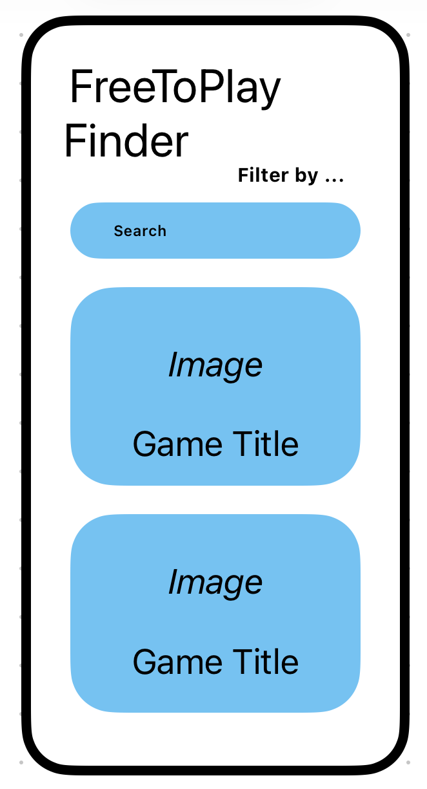

# **Free-To-Play Finder**

## Table of Contents

1. [App Overview](#App-Overview)
1. [Product Spec](#Product-Spec)
1. [Wireframes](#Wireframes)
1. [Build Notes](#Build-Notes)

## App Overview

### Description 
Free-To-Play Finder is an app that pulls from the FreeToGame database, a compilation of every game that is available to play for completely free on PC. Our app takes this information and formats it in a way that allows users to easily scroll and browse for games that could interest them. Users are then able to refine their search for games based on any particular genre or publisher that they are interested in.

### App Evaluation

<!-- Evaluation of your app across the following attributes -->

- **Mobile:** This product experience's focal product is pc games that are free to play. Unlike PC's, mobile phones are almost always accessible and well, mobile. This makes searching for a pc game convenient and simple.
- **Story:** The value of this app is quite clear to the audience, given that many game stores are difficult to navigate and riddled with ads. Our app is simple and to the point, featuring only free-to-play games.
- **Market:** The market for this app would be quite large because pc games are vastly popular worldwide, and no-cost games are appealing to everyone. The audience of this app ranges from teens to adults who game.
- **Habit:** Our user would just consume our app to search for games; it would likely be something used periodically to search for a new game.
- **Scope:** It is a medium sized, technically challenging task given the API we need to use, but our goal is clear. 

## Product Spec

### 1. User Features (Required and Optional)

Required Features:

- User can search for games
- User can see game icons/headers in the results
- User can filter based on genre

Stretch Features:
- User can filter by publisher, genre, or alphabetically
- User can scroll by clicking and dragging mouse or with keyboard
- User can click on the game as they scroll and view a short description

### 2. Chosen API(s)

FreeToGame API
- Get game title
  - We get the game title from the API
- Get game genre
  - We get the game genre from the API
- Get game publisher
  - We get the game publisher from the API
- Get game thumbnail
  - We get the game thumbnail from the API
- Get game description
  - We get the short game description from the API

### 3. User Interaction

Required Feature

- User can scroll
  - => User can scroll through game thumbnails and titles
- User selects a game
  - => It shows more details about the game
- User selects sort by
  - => It gives user the option to sort by default, a-z, z-a, genre, or publisher

## Wireframes

<!-- Add picture of your hand sketched wireframes in this section -->

### [BONUS] Digital Wireframes & Mockups

### [BONUS] Interactive Prototype

## Build Notes

Here's a place for any other notes on the app, it's creation 
process, or what you learned this unit!  

For Milestone 2, include **2+ Videos/GIFs** of the build process here!

Here are a few GIFs that showcase the progress we've made working on our app:

- An initial GIF showcasing the usage of our app along with some of the code that makes it run:
- 

- A more updated showcase of the sorting feature and the options we've included:

## License

Copyright **2025** **Lopez**

Licensed under the Apache License, Version 2.0 (the "License");
you may not use this file except in compliance with the License.
You may obtain a copy of the License at

    http://www.apache.org/licenses/LICENSE-2.0

Unless required by applicable law or agreed to in writing, software
distributed under the License is distributed on an "AS IS" BASIS,
WITHOUT WARRANTIES OR CONDITIONS OF ANY KIND, either express or implied.
See the License for the specific language governing permissions and
limitations under the License.
